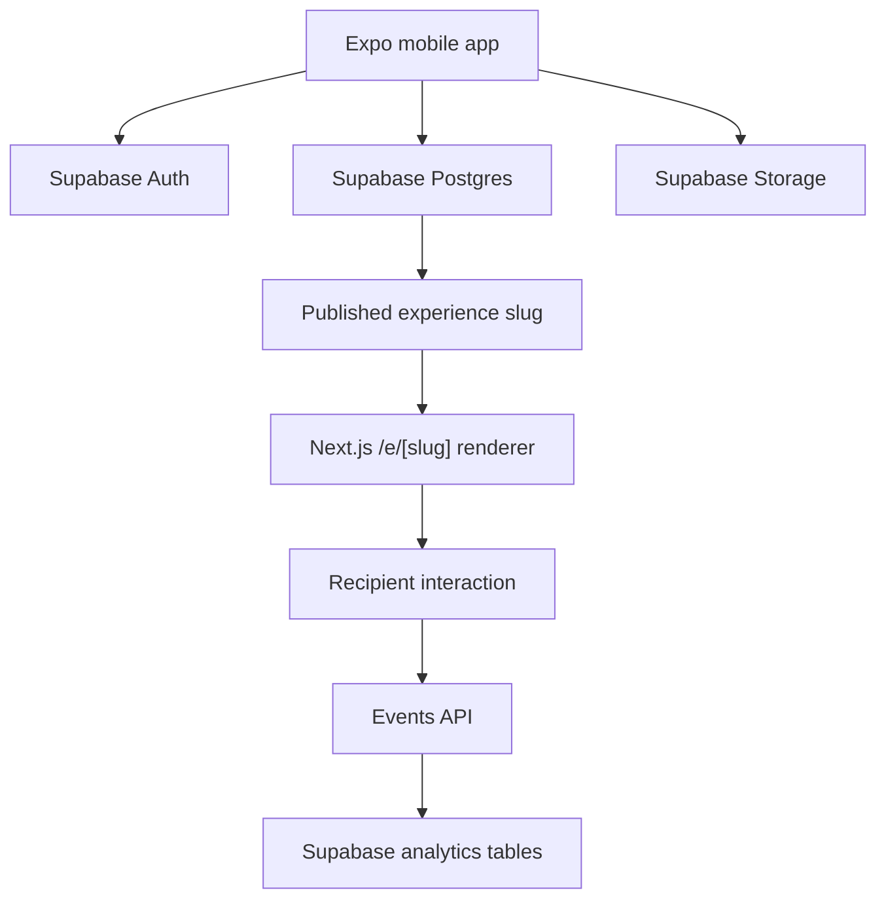

# AIRPLANE Architecture

AIRPLANE is split into a creator mobile app, public web renderer, shared contracts, and Supabase backend.

## Apps

- `apps/mobile`: creator workflow for auth, templates, builder, preview, publishing, sharing, subscription entry points, and analytics entry points.
- `apps/web`: public recipient renderer for `/e/[slug]`, `/template/[id]`, `/preview/[id]`, and `/api/events`.
- `packages/shared`: product types, constants, and validation schemas.
- `packages/supabase`: typed Supabase client and database row mappers.

## MVP Boundary

Version 1 includes templates, builder, publishing, public renderer, analytics, subscriptions, and Razorpay contracts. AI, marketplace, feed, community, chat, voice, and video generation are intentionally excluded.
